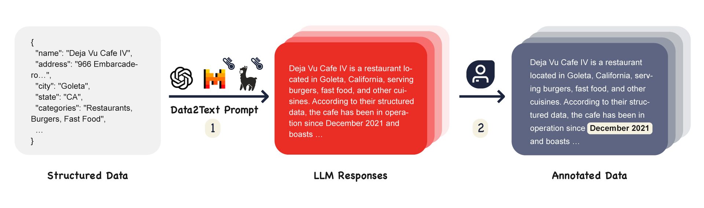

# RAGTruth


RAGTruth is a word-level hallucination corpus in various tasks within the Retrieval-augmented generation (RAG) setting both for **training** and **evaluating**.

RAG has become a main technique for alleviating hallucinations in large language models (LLMs). Despite the integration of RAG, LLMs may still present unsupported or contradictory claims to the retrieved contents. In order to develop effective hallucination prevention strategies under RAG, it is important to create benchmark datasets that can measure the extent of hallucination. RAGTruth comprises nearly 18,000 naturally generated responses from diverse LLMs using RAG. These responses have undergone meticulous manual annotations at both the individual cases and word levels, incorporating evaluations of hallucination intensity.

## Updates
1. [2024/06] We released our training and evaluation code. Model weight can be found [here](https://github.com/CodingLL/RAGTruth_Eval/tree/master)
2. [2024/02] We updated the data: we included more annotated hallucinations and added one new meta, `implicit_true`.
3. [2024/01] We released the RAGTruth corpus.
## Dataset
Given that each piece of source information elicits six distinct responses from various Language Models, we publish the source information and its corresponding responses individually.

1. **response.jsonl**

| Field Name  | Field Value | Description                                 |
| ----------- | ----------- | ------------------------------------------- |
| id          | String       | The index of the response.                |
| source_id         | String     | The index of the source information.  |
| model   | String      | The model that generates the response.  |
| temperature           | Float      | The temperature when generating response.          |
| labels           |List[Dict]      | The hallucination spans. `text` is the hallucination itself; `start` & `end` are the position of hallucination span in the response; `label_type` is the type of the hallucination span. `due_to_null` means whether the hallucination is caused by null value. `implicit_true` means this span is correct while the info is not mentioned in the context. `meta` is the comment of the hallucination given by annotators.      |
| split           | String      |  `train` or `test`           |
| quality          | String      | Indicate whether this answer has quality issues. `incorrect_refusal` means the model mistakenly refuses to answer despite the presence of the relevant context. `truncated` means the response is truncated unexpectedly.    |
| response      | String      | The response of LLMs given a certain instruction.  |

Sample:
```json
{
  "id": "1472",
  "source_id": "11316",
  "model": "mistral-7B-instruct",
  "temperature": 0.925,
  "labels": [
    {
      "start": 219,
      "end": 229,
      "text": "Gaza Strip",
      "meta": "HIGH INTRO OF NEW INFO\nIt is not mentioned in the original source that Gaza Strip is included in the occupied Palestinian territory.",
      "label_type": "Evident Baseless Info"
    }
  ],
  "split": "train",
  "quality": "good",
  "response": "The Palestinian Authority has officially become the 123rd member of the International Criminal Court (ICC), giving the court jurisdiction over alleged crimes in Palestinian territories. This includes East Jerusalem and Gaza Strip, which are occupied by Israel. The signing of Rome Statute by Palestinians in January 2021 had already established ICC's jurisdiction over alleged crimes committed \"since June 13, 2014\" in these areas. Now, the court can open a preliminary investigation or formal investigation into the situation in Palestinian territories, potentially leading to war crimes probes against Israeli individuals. However, this could also lead to counter-charges against Palestinians. The ICC welcomed Palestine's accession, while Israel and the US, who are not ICC members, opposed the move."
}
```

2. **source_info.jsonl**

| Field Name  | Field Value | Description                                 |
| ----------- | ----------- | ------------------------------------------- |
| source_id         | String     | The index of the source information.  |
| task_type           | String      | The task type of the data, including QA, Data2txt and Summary         |
| source | String      |  The source of the original content.    |
| source_info | String or Dict     | Base content under RAG setting. For summarization tasks, the value of this field is of the string type; for data-to-text and QA (question-answering) tasks, the value of this field is of the dict type.    |
| prompt | String | The prompt we used to generate responses. For Llama and Mistral models, we used `<s>[INST] {prompt} [/INST]`. |

QA sample:
```json
{
  "source_id": "14312",
  "task_type": "QA",
  "source": "MARCO",
  "source_info": {
    "question": "how to prepare beets and beet greens",
    "passages": "passage 1:Procedures: 1  Preheat oven to 350 degrees Fahrenheit. 2  Wash beets thoroughly, leaving skins on. 3  Place beets in a small baking dish or roasting pan, toss with 2 tablespoons of coconut oil, cover and bake for 45 to 60 minutes or until tender.  For the greens: heat remaining coconut oil in a skillet over medium-low heat.\n\npassage 2:Serve with red wine vinegar or butter and salt and pepper. For the greens: heat remaining coconut oil in a skillet over medium-low heat. Add garlic and onion and cook for one minute. Tear the beet greens into 2 to 3 inch pieces, and add to skillet, stirring until wilted and tender. Season with salt and pepper.\n\npassage 3:Directions See How It's Made. 1  Wash the greens thoroughly several times in deep water. Cook in very little boiling salted water until just tender, a few minutes. 2  Submit a Correction.\n\n"
  },
  "prompt": "Briefly answer the following question:\nhow to prepare beets and beet greens\nBear in mind that your response should be strictly based on the following ten passages:\npassage 1:Procedures: 1  Preheat oven to 350 degrees Fahrenheit. 2  Wash beets thoroughly, leaving skins on. 3  Place beets in a small baking dish or roasting pan, toss with 2 tablespoons of coconut oil, cover and bake for 45 to 60 minutes or until tender.  For the greens: heat remaining coconut oil in a skillet over medium-low heat.\n\npassage 2:Serve with red wine vinegar or butter and salt and pepper. For the greens: heat remaining coconut oil in a skillet over medium-low heat. Add garlic and onion and cook for one minute. Tear the beet greens into 2 to 3 inch pieces, and add to skillet, stirring until wilted and tender. Season with salt and pepper.\n\npassage 3:Directions See How It's Made. 1  Wash the greens thoroughly several times in deep water. Cook in very little boiling salted water until just tender, a few minutes. 2  Submit a Correction.\n\nIn case the passages do not contain the necessary information to answer the question, please reply with: \"Unable to answer based on given passages.\"\noutput:"
}
```

Data2txt sample:
```json
{
  "source_id": "13661",
  "task_type": "Data2txt",
  "source": "Yelp",
  "source_info": {
    "name": "Subway",
    "address": "1940 Cliff Dr, Ste B-13",
    "city": "Santa Barbara",
    "state": "CA",
    "categories": "Restaurants, Sandwiches, Salad, Fast Food",
    "hours": {
      "Monday": "9:0-22:30",
      "Tuesday": "9:0-22:30",
      "Wednesday": "9:0-22:30",
      "Thursday": "9:0-22:30",
      "Friday": "9:0-22:30",
      "Saturday": "9:0-22:30",
      "Sunday": "11:0-22:0"
    },
    "attributes": {
      "BusinessParking": {
        "garage": false,
        "street": false,
        "validated": false,
        "lot": true,
        "valet": false
      },
      "RestaurantsReservations": false,
      "OutdoorSeating": true,
      "WiFi": "no",
      "RestaurantsTakeOut": true,
      "RestaurantsGoodForGroups": true,
      "Music": null,
      "Ambience": {
        "touristy": false,
        "hipster": false,
        "romantic": null,
        "divey": null,
        "intimate": null,
        "trendy": null,
        "upscale": null,
        "classy": null,
        "casual": null
      }
    },
    "business_stars": 3.0,
    "review_info": [
      {
        "review_stars": 1.0,
        "review_date": "2020-05-11 02:07:36",
        "review_text": "My husband and I came in earlier today for lunch after I ordered my sandwich my husband ordered a club and didn't think anything about it while the girl made it because he assumed she knew what went on a club.  Once we got in the car I looked at the receipt and realized she made him a turkey sandwich so we went back in to ask her to add the other meat and to refund us and recharge the correct price since a club is a little more. She was very rude about it and told us she wasn't going to do anything about and proceeded to call us liars and say he asked for a turkey sub. I told her she didn't have to be so rude so she told me to \"get the f**k out b***h\" and if I had a problem with it I could \"call her f***ing manager\". Also she proceeded to cuss us as we walked out of the store. It was quite unacceptable and inappropriate of an employee to be this unprofessional and aggressive."
      },
      {
        "review_stars": 3.0,
        "review_date": "2020-03-02 20:05:55",
        "review_text": "Small store, personnel not very well organized, store is only moderately clean. \nStaff is friendly sometimes, other times they will only barely recognize you."
      },
      {
        "review_stars": 5.0,
        "review_date": "2019-07-10 01:49:07",
        "review_text": "Nice and clean location. Toppings look fresh and well stocked. Joaquin and Odalis are always helpful and friendly."
      }
    ]
  },
  "prompt": "Instruction:\nWrite an objective overview about the following local business based only on the provided structured data in the JSON format. You should include details and cover the information mentioned in the customers' review. The overview should be 100 - 200 words. Don't make up information. Structured data:\n{'name': 'Subway', 'address': '1940 Cliff Dr, Ste B-13', 'city': 'Santa Barbara', 'state': 'CA', 'categories': 'Restaurants, Sandwiches, Salad, Fast Food', 'hours': {'Monday': '9:0-22:30', 'Tuesday': '9:0-22:30', 'Wednesday': '9:0-22:30', 'Thursday': '9:0-22:30', 'Friday': '9:0-22:30', 'Saturday': '9:0-22:30', 'Sunday': '11:0-22:0'}, 'attributes': {'BusinessParking': {'garage': False, 'street': False, 'validated': False, 'lot': True, 'valet': False}, 'RestaurantsReservations': False, 'OutdoorSeating': True, 'WiFi': 'no', 'RestaurantsTakeOut': True, 'RestaurantsGoodForGroups': True, 'Music': None, 'Ambience': {'touristy': False, 'hipster': False, 'romantic': None, 'divey': None, 'intimate': None, 'trendy': None, 'upscale': None, 'classy': None, 'casual': None}}, 'business_stars': 3.0, 'review_info': [{'review_stars': 1.0, 'review_date': '2020-05-11 02:07:36', 'review_text': 'My husband and I came in earlier today for lunch after I ordered my sandwich my husband ordered a club and didn\\'t think anything about it while the girl made it because he assumed she knew what went on a club.  Once we got in the car I looked at the receipt and realized she made him a turkey sandwich so we went back in to ask her to add the other meat and to refund us and recharge the correct price since a club is a little more. She was very rude about it and told us she wasn\\'t going to do anything about and proceeded to call us liars and say he asked for a turkey sub. I told her she didn\\'t have to be so rude so she told me to \"get the f**k out b***h\" and if I had a problem with it I could \"call her f***ing manager\". Also she proceeded to cuss us as we walked out of the store. It was quite unacceptable and inappropriate of an employee to be this unprofessional and aggressive.'}, {'review_stars': 3.0, 'review_date': '2020-03-02 20:05:55', 'review_text': 'Small store, personnel not very well organized, store is only moderately clean. \\nStaff is friendly sometimes, other times they will only barely recognize you.'}, {'review_stars': 5.0, 'review_date': '2019-07-10 01:49:07', 'review_text': 'Nice and clean location. Toppings look fresh and well stocked. Joaquin and Odalis are always helpful and friendly.'}]}\nOverview:"
}
```

Summary sample:
```json
{
  "source_id": "11316",
  "task_type": "Summary",
  "source": "CNN/DM",
  "source_info": "The Palestinian Authority officially became the 123rd member of the International Criminal Court on Wednesday, a step that gives the court jurisdiction over alleged crimes in Palestinian territories. The formal accession was marked with a ceremony at The Hague, in the Netherlands, where the court is based. The Palestinians signed the ICC's founding Rome Statute in January, when they also accepted its jurisdiction over alleged crimes committed \"in the occupied Palestinian territory, including East Jerusalem, since June 13, 2014.\" Later that month, the ICC opened a preliminary examination into the situation in Palestinian territories, paving the way for possible war crimes investigations against Israelis. As members of the court, Palestinians may be subject to counter-charges as well. Israel and the United States, neither of which is an ICC member, opposed the Palestinians' efforts to join the body. But Palestinian Foreign Minister Riad al-Malki, speaking at Wednesday's ceremony, said it was a move toward greater justice. \"As Palestine formally becomes a State Party to the Rome Statute today, the world is also a step closer to ending a long era of impunity and injustice,\" he said, according to an ICC news release. \"Indeed, today brings us closer to our shared goals of justice and peace.\" Judge Kuniko Ozaki, a vice president of the ICC, said acceding to the treaty was just the first step for the Palestinians. \"As the Rome Statute today enters into force for the State of Palestine, Palestine acquires all the rights as well as responsibilities that come with being a State Party to the Statute. These are substantive commitments, which cannot be taken lightly,\" she said. Rights group Human Rights Watch welcomed the development. \"Governments seeking to penalize Palestine for joining the ICC should immediately end their pressure, and countries that support universal acceptance of the court's treaty should speak out to welcome its membership,\" said Balkees Jarrah, international justice counsel for the group. \"What's objectionable is the attempts to undermine international justice, not Palestine's decision to join a treaty to which over 100 countries around the world are members.\" In January, when the preliminary ICC examination was opened, Israeli Prime Minister Benjamin Netanyahu described it as an outrage, saying the court was overstepping its boundaries. The United States also said it \"strongly\" disagreed with the court's decision. \"As we have said repeatedly, we do not believe that Palestine is a state and therefore we do not believe that it is eligible to join the ICC,\" the State Department said in a statement. It urged the warring sides to resolve their differences through direct negotiations. \"We will continue to oppose actions against Israel at the ICC as counterproductive to the cause of peace,\" it said. But the ICC begs to differ with the definition of a state for its purposes and refers to the territories as \"Palestine.\" While a preliminary examination is not a formal investigation, it allows the court to review evidence and determine whether to investigate suspects on both sides. Prosecutor Fatou Bensouda said her office would \"conduct its analysis in full independence and impartiality.\" The war between Israel and Hamas militants in Gaza last summer left more than 2,000 people dead. The inquiry will include alleged war crimes committed since June. The International Criminal Court was set up in 2002 to prosecute genocide, crimes against humanity and war crimes. CNN's Vasco Cotovio, Kareem Khadder and Faith Karimi contributed to this report.\n",
  "prompt": "Summarize the following news within 141 words:\nThe Palestinian Authority officially became the 123rd member of the International Criminal Court on Wednesday, a step that gives the court jurisdiction over alleged crimes in Palestinian territories. The formal accession was marked with a ceremony at The Hague, in the Netherlands, where the court is based. The Palestinians signed the ICC's founding Rome Statute in January, when they also accepted its jurisdiction over alleged crimes committed \"in the occupied Palestinian territory, including East Jerusalem, since June 13, 2014.\" Later that month, the ICC opened a preliminary examination into the situation in Palestinian territories, paving the way for possible war crimes investigations against Israelis. As members of the court, Palestinians may be subject to counter-charges as well. Israel and the United States, neither of which is an ICC member, opposed the Palestinians' efforts to join the body. But Palestinian Foreign Minister Riad al-Malki, speaking at Wednesday's ceremony, said it was a move toward greater justice. \"As Palestine formally becomes a State Party to the Rome Statute today, the world is also a step closer to ending a long era of impunity and injustice,\" he said, according to an ICC news release. \"Indeed, today brings us closer to our shared goals of justice and peace.\" Judge Kuniko Ozaki, a vice president of the ICC, said acceding to the treaty was just the first step for the Palestinians. \"As the Rome Statute today enters into force for the State of Palestine, Palestine acquires all the rights as well as responsibilities that come with being a State Party to the Statute. These are substantive commitments, which cannot be taken lightly,\" she said. Rights group Human Rights Watch welcomed the development. \"Governments seeking to penalize Palestine for joining the ICC should immediately end their pressure, and countries that support universal acceptance of the court's treaty should speak out to welcome its membership,\" said Balkees Jarrah, international justice counsel for the group. \"What's objectionable is the attempts to undermine international justice, not Palestine's decision to join a treaty to which over 100 countries around the world are members.\" In January, when the preliminary ICC examination was opened, Israeli Prime Minister Benjamin Netanyahu described it as an outrage, saying the court was overstepping its boundaries. The United States also said it \"strongly\" disagreed with the court's decision. \"As we have said repeatedly, we do not believe that Palestine is a state and therefore we do not believe that it is eligible to join the ICC,\" the State Department said in a statement. It urged the warring sides to resolve their differences through direct negotiations. \"We will continue to oppose actions against Israel at the ICC as counterproductive to the cause of peace,\" it said. But the ICC begs to differ with the definition of a state for its purposes and refers to the territories as \"Palestine.\" While a preliminary examination is not a formal investigation, it allows the court to review evidence and determine whether to investigate suspects on both sides. Prosecutor Fatou Bensouda said her office would \"conduct its analysis in full independence and impartiality.\" The war between Israel and Hamas militants in Gaza last summer left more than 2,000 people dead. The inquiry will include alleged war crimes committed since June. The International Criminal Court was set up in 2002 to prosecute genocide, crimes against humanity and war crimes. CNN's Vasco Cotovio, Kareem Khadder and Faith Karimi contributed to this report.\n\noutput:"
}
```

## Data Statistics
#### Descriptive Statistics Devided by Task

Task                  | Instances | Responses | Hallucination Responses | Hallucination Spans |
--- | --- | --- | --- | --- |
Summarization(CNN/DM)      | 628  | 3768   | 1165 | 1474 |
Summarization(Recent News) | 315  | 1890   | 521  | 598 |
Question Answering         | 989  | 5934   | 1724 | 2927 |
Data-to-text               | 1033 | 6198  | 4254 | 9290 |
Overall                    | 2965 | 17790 | 7664 | 14289 |


#### Descriptive Statistics Devided by LLMs

Model | Hallucination Responses | Hallucination Spans |
--- | --- | --- |
GPT-3.5-turbo-0613  | 401  | 533  |
GPT-4-0613          | 406  | 485  |
Llama-2-7B-chat     | 1832 | 3302 |
Llama-2-13B-chat    | 1677 | 3799 |
Llama-2-70B-chat    | 1395 | 2608 |
Mistral-7B-Instruct | 1953 | 3562 |

## Citation

Please cite our paper if you use our dataset:
```bibtex
@misc{wu2023ragtruth,
      title={RAGTruth: A Hallucination Corpus for Developing Trustworthy Retrieval-Augmented Language Models}, 
      author={Yuanhao Wu and Juno Zhu and Siliang Xu and Kashun Shum and Cheng Niu and Randy Zhong and Juntong Song and Tong Zhang},
      year={2023},
      eprint={2401.00396},
      archivePrefix={arXiv},
      primaryClass={cs.CL}
}
```

## Star History

[](https://star-history.com/#ParticleMedia/RAGTruth&Date)
